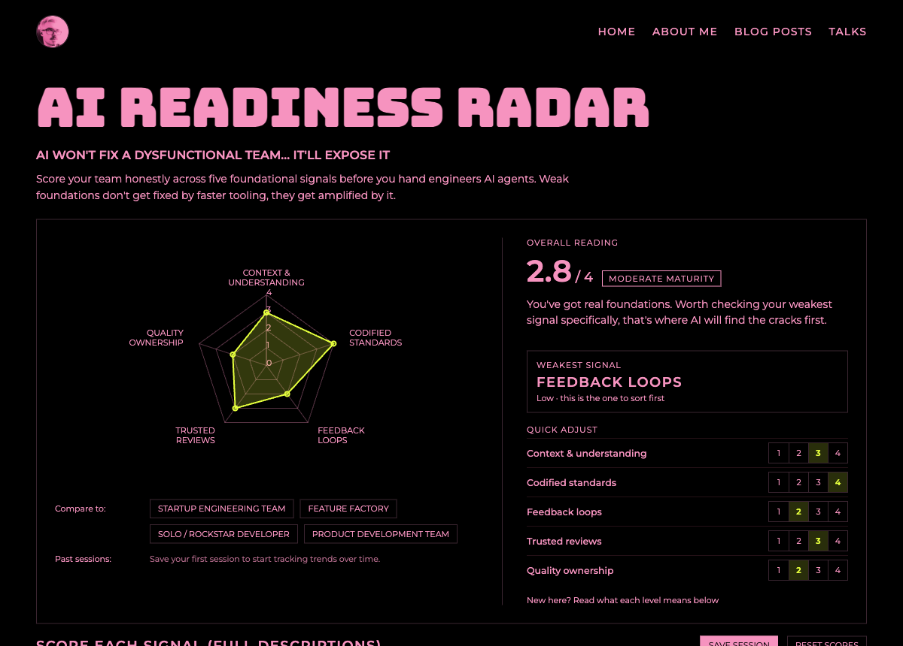

# AI Readiness Radar

An interactive diagnostic tool for scoring whether an engineering team's
foundations can support AI-assisted development. AI doesn't fix a
dysfunctional team, it exposes it — this tool helps you find the cracks
before you hand out agents.

Score your team across five signals, watch the radar update live, compare
against common team archetypes, and save sessions to track how your scores
trend over time.

**Live:** [radar.cakehurstryan.com](https://radar.cakehurstryan.com/)



## Signals

- **Context & understanding** — does the team know what "good enough" means?
- **Codified standards** — is what "good" looks like actually written down?
- **Feedback loops** — does the pipeline catch failures before a customer does?
- **Trusted reviews** — do reviews catch real issues, or are they rubber-stamped?
- **Quality ownership** — is quality a whole-team concern, or thrown over the wall?

Each signal is scored 1–4 (No maturity → Low → Moderate → High).

## Scoring

There are two ways to score, kept in sync:

- **Quick adjust** — a compact 1–4 pad beside the radar for fast scoring with
  immediate visual feedback as the shape and overall reading update.
- **Score each signal (full descriptions)** — the detailed cards below, with
  the question and a description of every band, so scoring stays honest and
  consistent. On mobile the quick pad is hidden in favour of these cards.

The **Overall reading** panel summarises your average, maturity band, tailored
advice, and your weakest signal (the one to sort first).

## Tracking over time

Your in-progress scores auto-save to the browser as you go. When you're ready
to log an assessment, hit **Save session** to record it as a dated snapshot:

- Past sessions show up as pills you can overlay on the radar chart (alongside
  the archetype comparisons) to see a session against your current scores.
- The overall score and each signal show a trend indicator (▲/▼/–) against the
  most recently saved session.
- Delete individual sessions or clear all history at any time.

All data is stored locally in your browser (`localStorage`) — nothing leaves
your machine, and there's no account or backend involved.

## Getting started

```bash
npm install
npm run dev
```

Then open the URL Vite prints (default `http://localhost:5173`).

## Scripts

- `npm run dev` — start the local dev server
- `npm run build` — build for production into `dist/`
- `npm run preview` — preview the production build locally

## Stack

- [React](https://react.dev/)
- [Vite](https://vitejs.dev/)
- [Recharts](https://recharts.org/) for the radar chart
- Bungee + Montserrat (Google Fonts), styled to match
  [cakehurstryan.com](https://cakehurstryan.com)

## Deployment

Hosted free on **GitHub Pages**, built and published automatically by
[`.github/workflows/deploy.yml`](.github/workflows/deploy.yml) on every push to
the default branch. It's served from the custom subdomain
`radar.cakehurstryan.com` via the [`public/CNAME`](public/CNAME) file plus a DNS
`CNAME` record pointing at `cakehurstryan.github.io`, with HTTPS enforced.

Because the site is served from a subdomain root, `vite.config.js` uses the
default `base` of `/`.

## Usage

Run it as a team exercise: score each signal individually, plot the results
together, and where scores disagree, go with the lowest one. This sits
underneath frameworks like DORA, TMMi, or Team Topologies — it's a conversation
starter, not a replacement for them.

Framework by Callum Akehurst-Ryan · [cakehurstryan.com](https://cakehurstryan.com)

## License

MIT © 2026 Callum Akehurst-Ryan — see [LICENSE](LICENSE).
